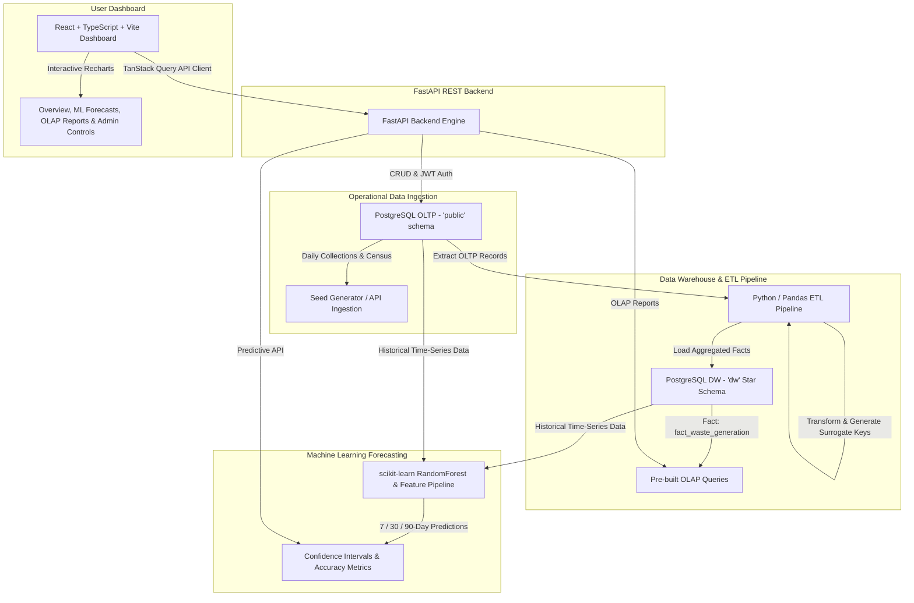
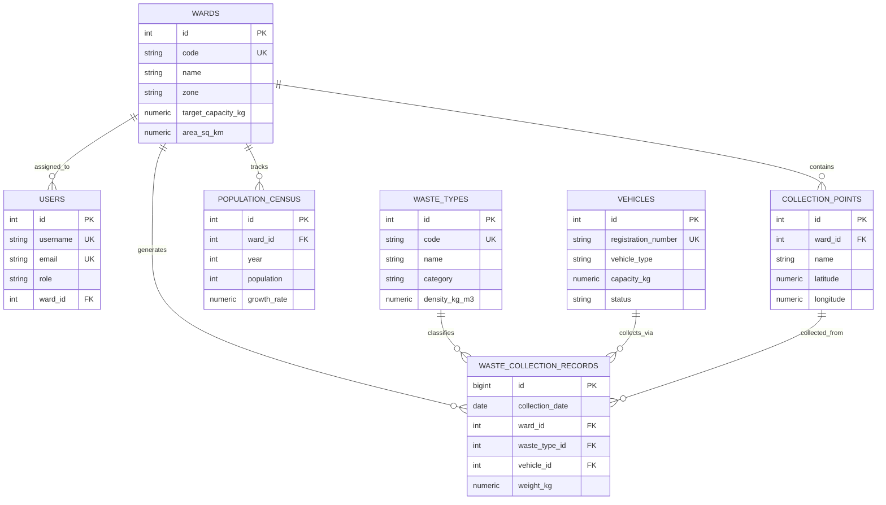
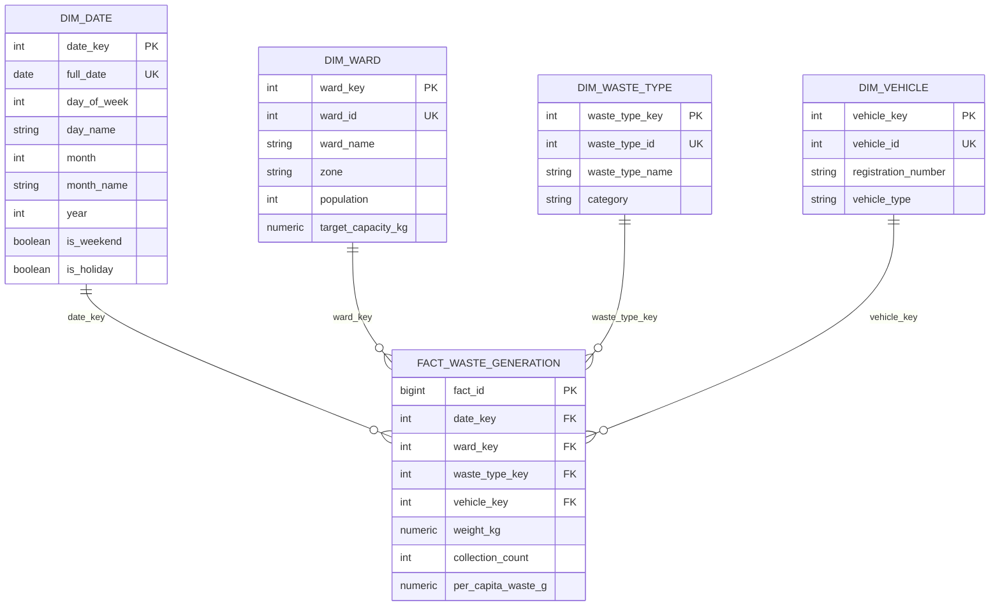

# Smart Waste Management Analytics: Municipal Data Warehouse & Garbage Generation Prediction System

A production-quality full-stack analytics platform built to assist municipal authorities in tracking, analyzing, and forecasting solid waste generation across city wards. The platform combines an operational transactional database (OLTP), a PostgreSQL Data Warehouse (OLAP Star Schema), an ETL pipeline, and a Machine Learning forecasting engine, all exposed via FastAPI and a React TypeScript dashboard.

---

## 🏗 System Architecture



---

## 🗄 Entity-Relationship (ER) Diagrams

### 1. Operational Database Schema (`public` Schema - OLTP)



### 2. Data Warehouse Star Schema (`dw` Schema - OLAP)



---

## 🔑 Quick Demo Credentials

All accounts use password: `password123`

| Role | Username | Email | Access Permissions |
| :--- | :--- | :--- | :--- |
| **Admin** | `admin` | `admin@metro.gov.in` | Full management, manual ETL execution, model retraining, collection logging |
| **Ward Officer** | `officer_w01` | `officer_w01@metro.gov.in` | Collection entry logging, Ward 1 overview & predictions |
| **Analyst** | `analyst` | `analyst@metro.gov.in` | Data Warehouse OLAP queries, CSV export, prediction inspections |

---

## ⚡ Quick Start with Docker Compose

Spin up PostgreSQL database, FastAPI backend, and React dashboard with a single command:

```bash
# 1. Clone repository & navigate to directory
cd Implementation

# 2. Launch container stack
docker-compose up --build
```

Access services:
- **Frontend Dashboard:** [http://localhost](http://localhost) (or `http://localhost:5173` in local dev mode)
- **FastAPI OpenAPI Docs:** [http://localhost:8000/docs](http://localhost:8000/docs)
- **PostgreSQL Database:** `localhost:5432` (`waste_dw_db`)

---

## 💻 Manual Setup & Local Execution

### 1. Database & Seed Data
```bash
# Ensure PostgreSQL is running locally with user 'waste_user' and database 'waste_dw_db'
psql -U waste_user -d waste_dw_db -f db/init_schemas.sql

# Seed 2+ years of realistic daily operational data (~11,000+ records)
python db/seed_data.py
```

### 2. Backend & ETL Pipeline
```bash
cd backend
python -m venv venv
source venv/bin/activate  # On Windows: venv\Scripts\activate
pip install -r requirements.txt

# Run initial ETL to populate Data Warehouse
python app/etl/pipeline.py

# Launch FastAPI Server
uvicorn app.main:app --reload --port 8000
```

### 3. Frontend Dashboard
```bash
cd frontend
npm install
npm run dev
```

---

## 🧪 Testing

Run backend Pytest suite:
```bash
cd backend
pytest -v
```

---

## 📁 Repository Structure

```
Implementation/
├── backend/
│   ├── app/
│   │   ├── api/v1/endpoints/  # Auth, Wards, Collections, Analytics, Predictions, Admin
│   │   ├── core/              # Config, Security, JWT Tokens
│   │   ├── etl/               # Pandas ETL Pipeline & OLAP Query Engine
│   │   ├── ml/                # Time-Series Feature Engineering & ML Forecaster
│   │   └── main.py            # FastAPI Entry Point & APScheduler
│   ├── tests/                 # Pytest test suite
│   ├── Dockerfile
│   └── requirements.txt
├── db/
│   ├── init_schemas.sql       # DDL for public (OLTP) and dw (OLAP) schemas
│   └── seed_data.py           # 2+ Year synthetic collection dataset generator
├── frontend/
│   ├── src/
│   │   ├── components/        # Navbar, Sidebar, Overview, Prediction, Reports, Admin
│   │   ├── services/          # API Client Layer
│   │   ├── types.ts           # TypeScript interfaces
│   │   └── App.tsx
│   ├── Dockerfile
│   └── package.json
├── docker-compose.yml
├── .env.example
└── README.md
```
